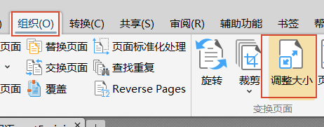
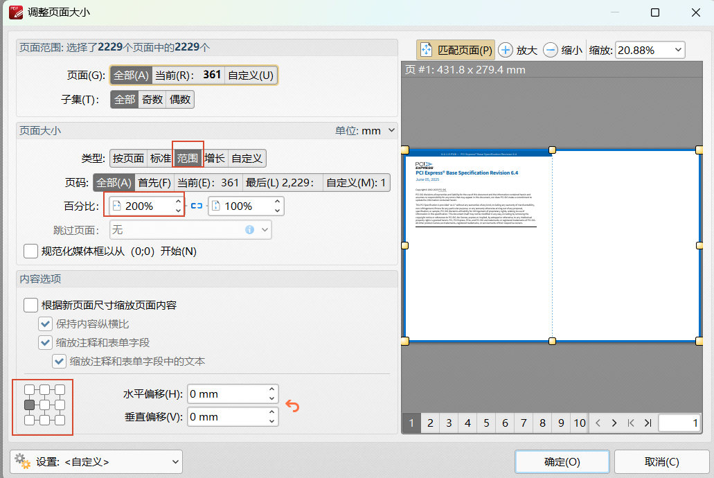
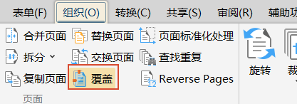
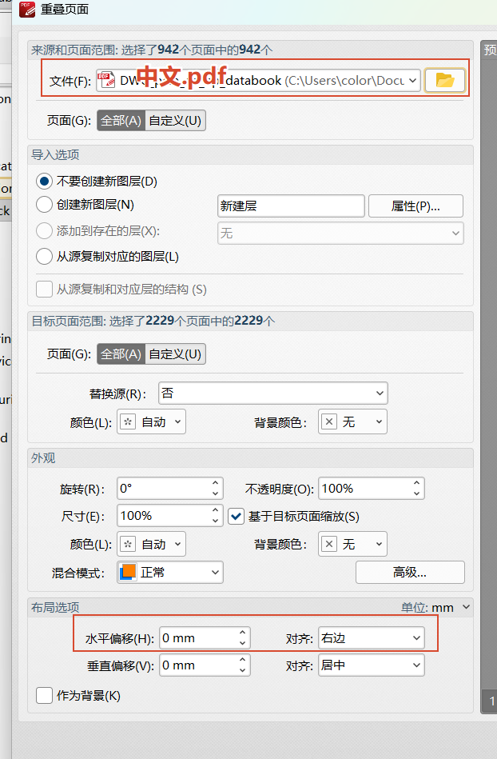
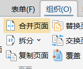
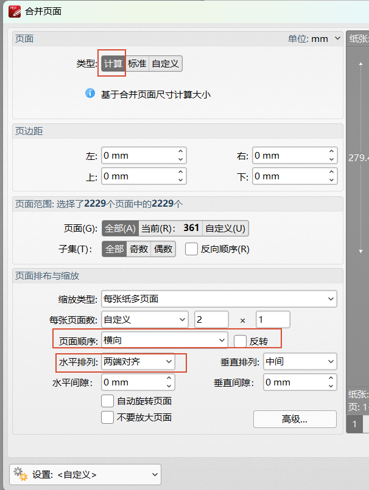

## 合并页面

中英文左右对照合并

## 一、两份文档，英文.pdf，中文.pdf合为一份

1.先备份英文.pdf，然后打开

2.组织，调整大小

3.设置范围，全部，百分比取消关联，并且选200%：100%，左对齐

4.确定即可，这里目的是把英文文档扩大一倍，右边让中文页面来覆盖。

5.组织，覆盖

6.选择中文.pdf，水平对齐，右边

7.确定即可。

## 二、一份文档，其中英文中文间隔页面

文档为，一页英文，一页中文，这样依次，可以使用下面方法：

1.组织，合并页面，

2.合并页面，计算，每张页面数，自定义，2 x 1，横向，水平排列。

3.确定即可。