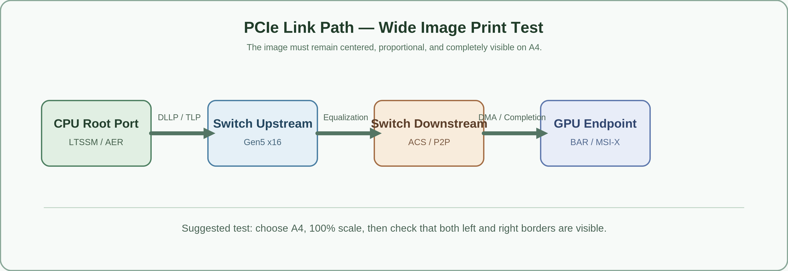
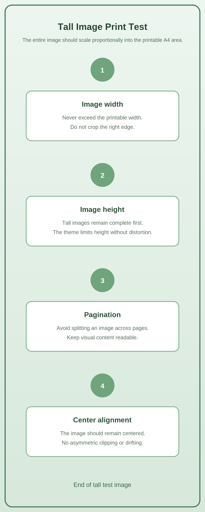
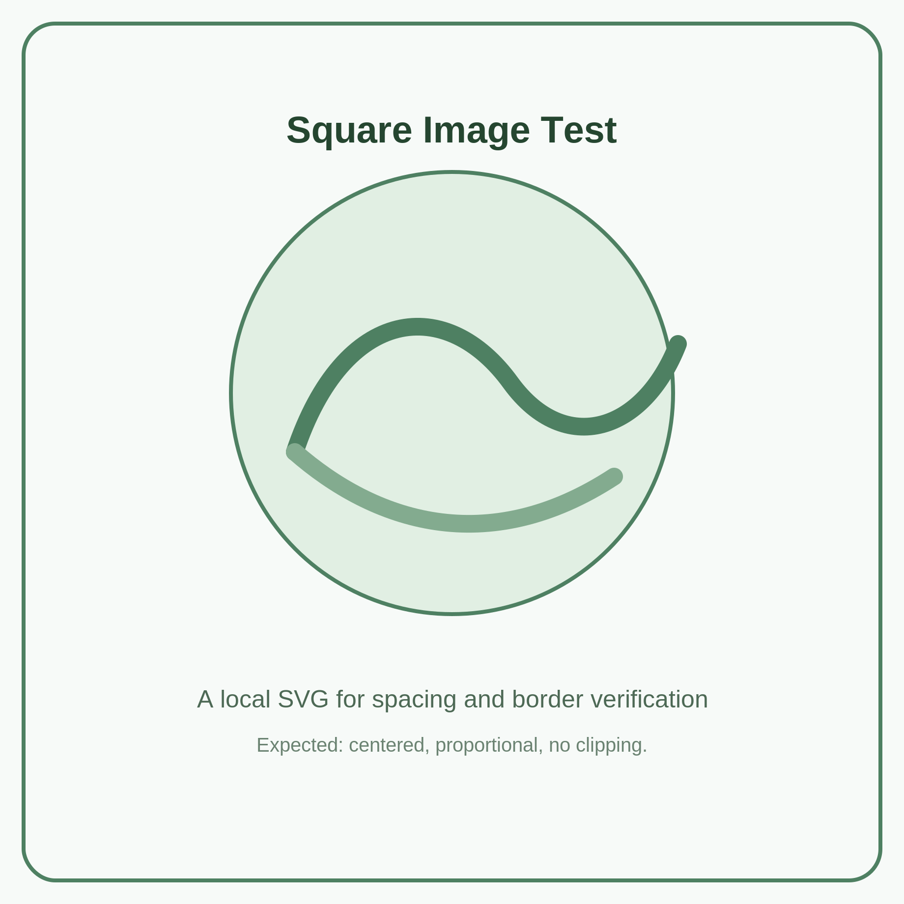
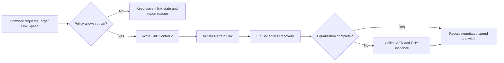

# Jiandu A4 Print Test / 简读 A4 打印测试

> Purpose: verify that the theme produces an A4 PDF with complete images, readable PCIe tables, wrapped code lines, and stable page breaks.  
> 目的：验证该主题可以生成图片完整、PCIe 表格可读、代码不被右侧裁切、分页稳定的 A4 PDF。

**Recommended test steps / 建议测试步骤：**

1. In Typora, select `Jiandu Natural Paper` or any other Jiandu screen theme.  
   在 Typora 中选择 `Jiandu Natural Paper` 或任意其他简读屏幕主题。
2. Open this Markdown file directly from the package folder.  
   直接从本主题包文件夹打开本 Markdown 文件。
3. Print or export to PDF with A4 paper and 100% scale.  
   用 A4 纸张、100% 缩放打印或导出 PDF。
4. Check the list at the end of this document.  
   对照本文末尾的检查清单确认效果。

---

## 1. Mixed Text / 中英文混排文本

PCIe 技术文档常包含中文说明、英文协议名、寄存器字段、位定义与命令行。This paragraph deliberately mixes Chinese and English so you can check line breaks, punctuation, and the reading rhythm of the selected screen font.

When the Endpoint receives a Configuration Write Request, the firmware must update the shadow register only after completing the required validation. 对于涉及 Link Control、AER、LTSSM 或 PHY 参数的配置，建议在文档中明确写清触发条件、状态机影响、软件可见性和恢复路径。

Use **strong emphasis / 加粗强调**, *italic emphasis / 斜体强调*, `Completion Timeout`, <kbd>Ctrl</kbd> + <kbd>P</kbd>, and ==highlighted text / 高亮文字== to verify inline elements.

> A block quote should have a quiet grey background in print, a thin coloured left rule, and should not be cut in half unnecessarily.  
> 引用块在打印时应保持浅灰底、细色条，并尽量不被拆开。

---

## 2. Image Fitting / 图片完整显示

### 2.1 Wide technical diagram / 超宽技术示意图



*Expected / 预期：图片居中、保持比例、左右边框完整可见，不得出现右侧裁切。*

### 2.2 Tall image / 竖向长图



*Expected / 预期：长图优先完整缩放；不得拉伸变形；尽量不在图片中间断页。*

### 2.3 Square image / 方图



*Expected / 预期：方图居中，与上下正文保持稳定留白。*

---

## 3. PCIe-Style Table / PCIe 风格表格

| Register / 寄存器 | Bits / 位 | Access / 访问 | Reset / 复位值 | Long behavior description / 长行为说明 | Firmware and software notes / 固件与软件说明 |
|---|---:|---|---:|---|---|
| `PCI_EXP_LNKCTL2_TARGET_LINK_SPEED` | `[3:0]` | RW | `0001b` | Selects the target speed used by software-initiated retraining. A value above the capability advertised by the local port or its partner must not cause the link to advertise an unsupported speed. | Firmware should retain the requested value, issue retraining only when policy permits it, and log the final negotiated generation after Recovery completes. |
| `PCI_EXP_LNKSTA2_CURRENT_DEEMPHASIS_LEVEL` | `[0]` | RO | Implementation defined | Indicates the de-emphasis level currently applied by the link. The field is often inspected together with Link Status, Equalization Complete, and phase success flags when debugging Gen3 or higher equalization. | In a bring-up log, record the preset, coefficient update path, downstream capability, and whether the state machine returned to Recovery or proceeded to L0. |
| `AER_UNCORRECTABLE_ERROR_STATUS` | `[31:0]` | RW1C | `00000000h` | Captures uncorrectable errors such as Completion Timeout, Unsupported Request, Malformed TLP, Surprise Down Error, or poisoned TLP reception. | Software clears only the observed bits after preserving evidence. Firmware must not hide a fatal root cause merely to make a test pass. |
| `DEVICE_CONTROL2_COMPLETION_TIMEOUT_VALUE` | `[3:0]` | RW | Platform defined | Chooses a Completion Timeout range. The selected range must satisfy endpoint behavior, root-complex policy, and any system-level latency assumptions. | Keep the configuration change traceable in the PCIe initialization log, especially when a platform needs a timeout of 10 ms or longer. |

**Expected / 预期：** 表格不越过右侧纸边；单元格内的长英文和长字段可以换行；长表跨页时表头尽量重复。

---

## 4. Code Block / 代码块

```c
/* Long line test / 长行测试：打印时应自动换行，而不是从右侧裁切。 */
static const char *pcie_debug_message = "Link retraining requested after target speed update; retain the requested configuration, wait for Recovery to finish, sample Link Status 2, then record the negotiated speed, lane width, Equalization Complete state, and any AER evidence before software continues.";

static void pcie_dump_link_state(struct pcie_port *port)
{
    log_info("port=%u state=%s speed=Gen%u width=x%u dll_active=%u eq_complete=%u phase1=%u phase2=%u phase3=%u aer_uncorr=0x%08x", port->id, port->ltssm_name, port->current_gen, port->current_width, port->dll_active, port->eq_complete, port->phase1_success, port->phase2_success, port->phase3_success, port->aer_uncorrectable_status);
}
```

Inline register example: `0x0000000000000042`, `LinkCtl2[3:0]`, and `LnkSta2.EqualizationComplete`.

---

## 5. Mermaid Diagram / Mermaid 图



**Expected / 预期：** Mermaid 图必须缩放进 A4 页面可用宽度，文字和箭头清晰可辨。

---

## 6. Task List / 任务列表

**Expected / 预期：** The checkbox is the native browser control, vertically aligned by Chromium rather than a manually positioned `✓`.  
**预期：** 复选框使用浏览器原生控件，由 Chromium 自动完成垂直对齐，而不是手工定位的 `✓`。

- [ ] Verify the wide SVG has no right-edge clipping.  
      确认超宽 SVG 的右侧没有被裁切。
- [ ] Verify the tall SVG remains proportional and readable.  
      确认长图没有拉伸变形，且内容仍可阅读。
- [ ] Verify the table wraps long cells and stays inside A4 margins.  
      确认表格长单元格会换行，并且不超出 A4 页边距。
- [ ] Verify the long code line wraps instead of disappearing at the right edge.  
      确认超长代码行会换行，而不是在右侧消失。
- [ ] Verify the heading hierarchy remains clear in grayscale printing.  
      确认即使灰阶打印，标题层级仍然清楚。

---

## 7. Page Break and Long Article Test / 分页与长文测试

A reliable print theme should not rely on screen colours to convey information. It should remain legible on an office printer where background graphics are disabled, on a monochrome printer, and after a PDF is viewed on another device. The main hierarchy should come from typography, whitespace, rules, and borders.

对于日记或文章，正文应该能够连续阅读，不应因为屏幕主题换成暖米色或夜间绿就把打印结果带入深色背景。对于 PCIe 技术资料，表格和代码块不能因为内容稍长就穿出右侧页面。对图片文档而言，完整显示比“原始像素尺寸”更重要：图片应缩小，但不能被裁掉。

The following repeated paragraph helps create a multi-page document. It is also useful for checking whether headings become stranded at the bottom of a page. 下面这段重复文字用于形成多页文档，也便于观察标题是否会孤零零地落在页尾。

PCIe firmware documentation is usually most useful when it distinguishes hardware capability, firmware policy, operating-system action, and observable evidence. A clear record should state what software wrote, what the LTSSM did, what the negotiated result became, and where the failure evidence was collected. 对于调试记录，最好同时列出复现条件、平台、链路拓扑、目标速率、实际速率、lane 宽度、AER 状态、软件日志和协议分析仪观察结果。

PCIe firmware documentation is usually most useful when it distinguishes hardware capability, firmware policy, operating-system action, and observable evidence. A clear record should state what software wrote, what the LTSSM did, what the negotiated result became, and where the failure evidence was collected. 对于调试记录，最好同时列出复现条件、平台、链路拓扑、目标速率、实际速率、lane 宽度、AER 状态、软件日志和协议分析仪观察结果。

PCIe firmware documentation is usually most useful when it distinguishes hardware capability, firmware policy, operating-system action, and observable evidence. A clear record should state what software wrote, what the LTSSM did, what the negotiated result became, and where the failure evidence was collected. 对于调试记录，最好同时列出复现条件、平台、链路拓扑、目标速率、实际速率、lane 宽度、AER 状态、软件日志和协议分析仪观察结果。

PCIe firmware documentation is usually most useful when it distinguishes hardware capability, firmware policy, operating-system action, and observable evidence. A clear record should state what software wrote, what the LTSSM did, what the negotiated result became, and where the failure evidence was collected. 对于调试记录，最好同时列出复现条件、平台、链路拓扑、目标速率、实际速率、lane 宽度、AER 状态、软件日志和协议分析仪观察结果。

---

## 8. Footnotes / 脚注

A Completion Timeout range should match the platform requirement rather than being selected casually.[^timeout] 需要保留完整日志和错误证据，而不是只判断“链路是否亮了”。[^evidence]

[^timeout]: Completion Timeout / 完成超时设置应结合设备、拓扑和系统策略验证。
[^evidence]: Evidence / 证据包括 AER 状态、配置空间快照、LTSSM 状态、协议分析仪记录和固件日志。

---

## Final Checklist / 最终检查清单

- [ ] A4 PDF has white paper and dark text even when the screen theme is dark.  
      即使屏幕主题为深色，A4 PDF 仍为白纸深色文字。
- [ ] The wide image is centered and fully visible.  
      宽图居中且完整显示。
- [ ] The tall image is proportional and not cropped.  
      长图等比显示，没有被裁切。
- [ ] Table text is readable and does not cross the page edge.  
      表格文字可读，且没有跨出页面右边。
- [ ] Code wraps safely.  
      代码会安全换行。
- [ ] Mermaid fits on the page.  
      Mermaid 图能放入页面。
- [ ] The hierarchy is clear in grayscale.  
      灰阶打印时层级仍然清晰。

---

## Single-layer Code Fence Test / 单层代码围栏测试

The following fence should render as one card only: one background, one border, and one padding layer.
Move the caret inside the fence: no full-line current-caret tint should appear.

下面这段围栏代码应只呈现为一张卡片：一层背景、一层边框、一层内边距。
将光标移入代码块：不应出现整行的光标行背景色。

```css
/* Outer fence only / 只美化外层围栏 */
.md-fences {
    padding: 0.92rem 1.08rem;
    border: 1px solid var(--jiandu-code-border);
}

/* Internal layers stay flat / 内部层保持扁平 */
.md-fences pre,
.md-fences .CodeMirror {
    margin: 0;
    padding: 0;
    background: transparent;
    border: 0;
}
```

